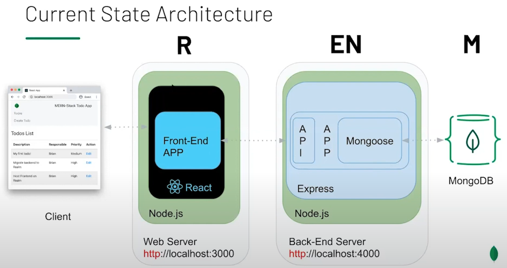

<div align="center">
    <h1> Title </h1>
    <p>
      <i>Tagline/description</i>
    </p>
</div>

> Badges "Netlify, Wakatime, NPM, snyk etc"

> Add gif by recording using[giphy](https://giphy.com/) desktop app

## Description

## Table of Contents

- [Description](#description)
- [Table of Contents](#table-of-contents)
- [🏁 Getting Started](#-getting-started)
  - [Prerequisites](#prerequisites)
- [⚙️ Scripts](#️-scripts)
- [Usage](#usage)
- [🛠️ Architecture](#️-architecture)
- [✔️ Deployment](#️-deployment)
- [✍️ Contributing](#️-contributing)
- [👨‍💻 Acknowledgements](#-acknowledgements)
- [🗂️ File Structure](#-file-structure)
- [📓 Resources](#-resources)
- [🏗️ Built With](#️-built-with)
- [📕 Liscence](#-liscence)

## 🏁 Getting Started

### Prerequisites

Before you begin, ensure you have met the following requirements:

- You have installed the latest version of <coding_language/dependency/requirement_1>

## ⚙️ Scripts

To install <project_name>, follow these steps:

Linux and macOS:

```javascript
npm install
```

## Usage

## 🛠️ Architecture

- Add image or architecture use [draw.io](https://app.diagrams.net/)



## ✔️ Deployment

## ✍️ Contributing

Pull requests are welcome. For major changes, please open an issue first to discuss what you would like to change.

## 👨‍💻 Acknowledgements

- [@Nash](https://github.com/NyashaNziramasanga)
- [How to write a readme (Article)](#)

## 🗂️ File Structure
```shell
Expo Firebase Starter
├── assets ➡️ All static assets
├── components ➡️ All re-suable UI components for form screens
│   └── Firebase ➡️ Firebase related config directory
│       └── firebaseConfig.js ➡️ Firebase API keys
├── navigation
│   └── AppStack.js ➡️ Protected routes such as Home screen
├── screens
│   └── ForgotPassword.js ➡️ Forgot Password screen component
│   └── HomeScreen.js ➡️ Protected route/screen component
├── utils
│   └── colors.js ➡️ Default, reusable values across the app
├── App.js ➡️ Entry Point for Mobile apps
├── app.json ➡️ Expo config file
```

## 📓 Resources

## 🏗️ Built With

- [tech](#)

## 📕 Liscence

This project uses the following license: <license_name>.
